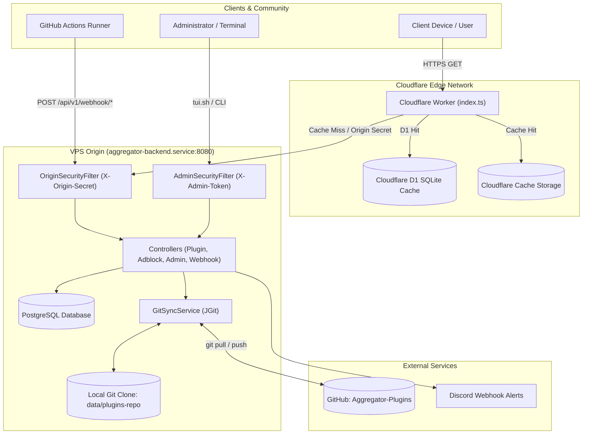
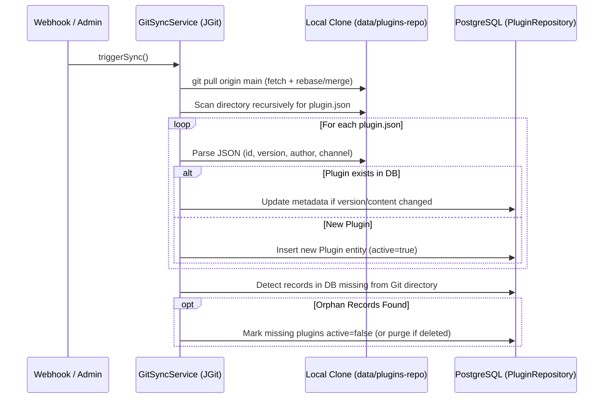
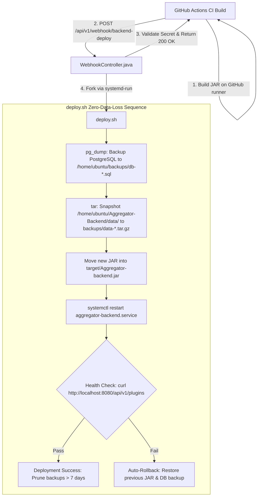

# Aggregator Backend - Architecture, File Reference & Contribution Guide

This document is a comprehensive developer manual for the **Aggregator Backend**. It describes every file in the repository, its purpose, how the different components interconnect, and the core algorithms and design patterns driving the system.

---

## Table of Contents
1. [System Architecture Overview](#system-architecture-overview)
2. [Directory Tree & File Reference](#directory-tree--file-reference)
   - [Root Scripts & Configuration](#root-scripts--configuration)
   - [Spring Boot Application Layer (`src/main/java`)](#spring-boot-application-layer-srcmainjava)
     - [Root & Configurations (`config`)](#root--configurations-config)
     - [Entities & Enums (`entity`)](#entities--enums-entity)
     - [Data Transfer Objects (`dto`)](#data-transfer-objects-dto)
     - [Repositories (`repository`)](#repositories--repository)
     - [Business Logic Services (`service`)](#business-logic-services-service)
     - [REST Controllers (`controller`)](#rest-controllers-controller)
     - [Terminal UI Dashboard (`tui`)](#terminal-ui-dashboard-tui)
   - [Resources & Tests (`src/main/resources`, `src/test`)](#resources--tests-srcmainresources-srctest)
   - [Cloudflare Edge Layer (`cloudflare-edge`)](#cloudflare-edge-layer-cloudflare-edge)
3. [Core Logic & Algorithms](#core-logic--algorithms)
   - [1. Git Sync & Repository Reconciliation Algorithm](#1-git-sync--repository-reconciliation-algorithm)
   - [2. Adblock Rule Management & Fast Line Serialization](#2-adblock-rule-management--fast-line-serialization)
   - [3. IP-Hashed Plugin Voting & Moderation Engine](#3-ip-hashed-plugin-voting--moderation-engine)
   - [4. Zero-Downtime / Zero-Data-Loss Deployment Pipeline](#4-zero-downtime--zero-data-loss-deployment-pipeline)
   - [5. Origin Protection & Edge Caching](#5-origin-protection--edge-caching)
   - [6. High-Performance Lanterna TUI Engine](#6-high-performance-lanterna-tui-engine)
4. [Developer Workflow & Contribution Checklist](#developer-workflow--contribution-checklist)

---

## System Architecture Overview

The Aggregator registry uses a hybrid tiered architecture:
1. **Edge Tier (Cloudflare Workers + D1 + Cache API):** Absorbs public traffic, serves cached metadata and `.zip` plugin downloads globally, validates and caches adblock domain blocklists, and enforces zero-trust origin protection.
2. **Origin Tier (Spring Boot 3 + PostgreSQL + JGit):** Authoritative source of truth for plugin state, ratings, moderation alerts, adblock lists, and administrative actions. Persists data to PostgreSQL and mirrors canonical plugin files to a GitHub repository (`Aggregator-Plugins`).
3. **Deployment / Ops Tier:** GitHub Actions trigger webhooks protected with shared cryptographic keys. Deploys run asynchronously out-of-process via `systemd-run` to prevent restart interrupts, taking PostgreSQL dumps and disk snapshots prior to service restart.
4. **Operations / TUI Tier:** A terminal UI ([`StandaloneTui.java`](file:///home/bread/Projects/Aggregator-Backend/src/main/java/com/github/deployedreject/Aggregator_backend/tui/StandaloneTui.java)) connects directly to the local or remote REST API with token authentication, styled with Tokyo Night colors.



---

## Directory Tree & File Reference

### Root Scripts & Configuration

| File | Purpose |
| :--- | :--- |
| [`pom.xml`](file:///home/bread/Projects/Aggregator-Backend/pom.xml) | Maven Project Object Model. Defines dependencies: Spring Boot 3 Web, JPA, Validation, PostgreSQL driver, JGit (Core + SSH Apache), Lanterna (Terminal GUI), Jackson, and testing frameworks. |
| [`deploy.sh`](file:///home/bread/Projects/Aggregator-Backend/deploy.sh) | Production deployment script. Safely performs database backup (`pg_dump`), file snapshot (`tar.gz`), unpacks the new `.jar` artifact, reloads the `systemd` service, and probes localhost health on port 8080. |
| [`tui.sh`](file:///home/bread/Projects/Aggregator-Backend/tui.sh) | Shell launcher for the Lanterna terminal dashboard. Reuses the precompiled backend JAR in standalone mode (`com.github.deployedreject.Aggregator_backend.tui.StandaloneTui`) to avoid slow Maven invocations. |
| [`README.md`](file:///home/bread/Projects/Aggregator-Backend/README.md) | High-level repository introduction and quick-start instructions. |
| [`HELP.md`](file:///home/bread/Projects/Aggregator-Backend/HELP.md) | Standard Spring Boot documentation notes and reference guides. |
| [`.gitignore`](file:///home/bread/Projects/Aggregator-Backend/.gitignore) | Git exclusions: build artifacts, IDE directories, local `data/` clones, node modules, and local docs. |

---

### Spring Boot Application Layer (`src/main/java`)

#### Root & Configurations (`config`)

* [`AggregatorBackendApplication.java`](file:///home/bread/Projects/Aggregator-Backend/src/main/java/com/github/deployedreject/Aggregator_backend/AggregatorBackendApplication.java):
  * **Role:** Spring Boot entry point (`@SpringBootApplication`).
  * **Function:** Boots Spring context, triggers component scans, and enables async task execution.

* [`config/AppProperties.java`](file:///home/bread/Projects/Aggregator-Backend/src/main/java/com/github/deployedreject/Aggregator_backend/config/AppProperties.java):
  * **Role:** Strongly typed configuration mapping (`@ConfigurationProperties(prefix = "app")`).
  * **Fields:**
    * `git`: Git repository URL, local clone path, branch (`main`), private key, sync schedules, webhook secret.
    * `security`: `originSecret` (Cloudflare tunnel key), `adminToken` (for admin routes & TUI), `deployToken` (for GitHub Action deploy webhooks).
    * `moderation`: Discord webhook URL, alert thresholds (dislike ratio percentage, minimum vote count).
    * `llm`: Base URLs, model selections, and proxy routing settings.

* [`config/OriginSecurityFilter.java`](file:///home/bread/Projects/Aggregator-Backend/src/main/java/com/github/deployedreject/Aggregator_backend/config/OriginSecurityFilter.java):
  * **Role:** Shielding filter running at order `Ordered.HIGHEST_PRECEDENCE + 1`.
  * **Logic:** Inspects incoming HTTP requests for `X-Origin-Secret`. When non-empty in config, any public request not originating from Cloudflare or localhost (127.0.0.1 / ::1) is rejected with HTTP 403 Forbidden.

* [`config/AdminSecurityFilter.java`](file:///home/bread/Projects/Aggregator-Backend/src/main/java/com/github/deployedreject/Aggregator_backend/config/AdminSecurityFilter.java):
  * **Role:** RBAC filter safeguarding all `/api/v1/admin/**` endpoints.
  * **Logic:** Checks the `X-Admin-Token` header. Rejects invalid tokens with HTTP 401 Unauthorized before reaching any admin controllers.

* [`config/AsyncConfig.java`](file:///home/bread/Projects/Aggregator-Backend/src/main/java/com/github/deployedreject/Aggregator_backend/config/AsyncConfig.java):
  * **Role:** Async execution tuning (`@EnableAsync`).
  * **Function:** Configures custom thread pools (`ThreadPoolTaskExecutor`) for asynchronous Git synchronization, Discord notification dispatch, and long-running webhook tasks.

* [`config/RestClientConfig.java`](file:///home/bread/Projects/Aggregator-Backend/src/main/java/com/github/deployedreject/Aggregator_backend/config/RestClientConfig.java):
  * **Role:** Configures modern Spring `RestClient` beans.
  * **Function:** Used for outbound HTTP communication (e.g. posting JSON alerts to Discord, communicating with LLM upstream providers).

---

#### Entities & Enums (`entity`)

* [`entity/Plugin.java`](file:///home/bread/Projects/Aggregator-Backend/src/main/java/com/github/deployedreject/Aggregator_backend/entity/Plugin.java):
  * **Table:** `plugins`
  * **Fields:** `id` (UUID), `pluginId` (String identifier e.g. `youtube-resolver`), `name`, `description`, `version`, `author`, `channel` (STABLE / BETA / EXPERIMENTAL), `filePath`, `downloadUrl`, `active` (boolean), `upvotes`, `downvotes`, `createdAt`, `updatedAt`.

* [`entity/PluginRating.java`](file:///home/bread/Projects/Aggregator-Backend/src/main/java/com/github/deployedreject/Aggregator_backend/entity/PluginRating.java):
  * **Table:** `plugin_ratings`
  * **Fields:** `id`, `plugin` (Many-to-One), `ipHash` (SHA-256 string), `vote` (`UP` / `DOWN`), `createdAt`, `updatedAt`.
  * **Constraint:** Unique composite constraint on `(plugin_id, ip_hash)` to enforce 1 vote per IP.

* [`entity/ModerationAlert.java`](file:///home/bread/Projects/Aggregator-Backend/src/main/java/com/github/deployedreject/Aggregator_backend/entity/ModerationAlert.java):
  * **Table:** `moderation_alerts`
  * **Fields:** `id`, `plugin` (Many-to-One), `reason`, `dislikePercentage`, `totalVotes`, `resolved` (boolean), `createdAt`.

* [`entity/PluginChannel.java`](file:///home/bread/Projects/Aggregator-Backend/src/main/java/com/github/deployedreject/Aggregator_backend/entity/PluginChannel.java):
  * **Enum:** `STABLE`, `BETA`, `EXPERIMENTAL`.

* [`entity/VoteType.java`](file:///home/bread/Projects/Aggregator-Backend/src/main/java/com/github/deployedreject/Aggregator_backend/entity/VoteType.java):
  * **Enum:** `UP`, `DOWN`.

---

#### Data Transfer Objects (`dto`)

* [`dto/PluginResponse.java`](file:///home/bread/Projects/Aggregator-Backend/src/main/java/com/github/deployedreject/Aggregator_backend/dto/PluginResponse.java): Outgoing JSON representation of plugin metadata, rating counts, release channels, and download URLs.
* [`dto/PluginSubmitRequest.java`](file:///home/bread/Projects/Aggregator-Backend/src/main/java/com/github/deployedreject/Aggregator_backend/dto/PluginSubmitRequest.java): Payload for submitting new plugins via API.
* [`dto/RateRequest.java`](file:///home/bread/Projects/Aggregator-Backend/src/main/java/com/github/deployedreject/Aggregator_backend/dto/RateRequest.java): Incoming payload for voting (`vote`: "UP" | "DOWN").
* [`dto/VoteResponse.java`](file:///home/bread/Projects/Aggregator-Backend/src/main/java/com/github/deployedreject/Aggregator_backend/dto/VoteResponse.java): Response returned after voting, showing new `upvotes`, `downvotes`, and user's current vote.
* [`dto/PagedResponse.java`](file:///home/bread/Projects/Aggregator-Backend/src/main/java/com/github/deployedreject/Aggregator_backend/dto/PagedResponse.java): Generic paginated response wrapper containing `content`, `page`, `size`, `totalElements`, `totalPages`, and `last`.
* [`dto/AdblockRulesResponse.java`](file:///home/bread/Projects/Aggregator-Backend/src/main/java/com/github/deployedreject/Aggregator_backend/dto/AdblockRulesResponse.java): Payload returning parsed adblocking rules (`version`, `count`, `rules` list, `updatedAt`).

---

#### Repositories (`repository`)

* [`repository/PluginRepository.java`](file:///home/bread/Projects/Aggregator-Backend/src/main/java/com/github/deployedreject/Aggregator_backend/repository/PluginRepository.java):
  * Spring Data JPA interface.
  * Queries: `findByPluginId(String id)`, `findByActiveTrue(Pageable pageable)`, `findByChannelAndActiveTrue(...)`, search queries with keyword filtering.
* [`repository/PluginRatingRepository.java`](file:///home/bread/Projects/Aggregator-Backend/src/main/java/com/github/deployedreject/Aggregator_backend/repository/PluginRatingRepository.java):
  * Queries: `findByPluginAndIpHash(Plugin plugin, String ipHash)`, `countByPluginAndVote(Plugin plugin, VoteType vote)`.
* [`repository/ModerationAlertRepository.java`](file:///home/bread/Projects/Aggregator-Backend/src/main/java/com/github/deployedreject/Aggregator_backend/repository/ModerationAlertRepository.java):
  * Queries: `findByResolvedFalseOrderByCreatedAtDesc()`, `findByPluginAndResolvedFalse(Plugin plugin)`.

---

#### Business Logic Services (`service`)

* [`service/GitSyncService.java`](file:///home/bread/Projects/Aggregator-Backend/src/main/java/com/github/deployedreject/Aggregator_backend/service/GitSyncService.java):
  * **Role:** Manages the local Git clone of `Aggregator-Plugins` using JGit.
  * **Capabilities:**
    * Clone / pull tracking branch `origin/main` over SSH using custom key credentials or HTTPS.
    * Reconciles files on disk (`plugin.json` descriptors) with the PostgreSQL database.
    * Commits and pushes deletions (`deletePluginAndCommit`) or adblock rule modifications (`commitAndPushAdblockRules`).
    * Parses and writes the adblocking blocklist (`ads/blocklist.txt`).

* [`service/PluginService.java`](file:///home/bread/Projects/Aggregator-Backend/src/main/java/com/github/deployedreject/Aggregator_backend/service/PluginService.java):
  * **Role:** Manages business logic around plugins.
  * **Capabilities:** Fetching active plugins with pagination, toggling active states, updating release channels, fetching binary files for download, and transactional cascading deletion (`deletePlugin`).

* [`service/RatingService.java`](file:///home/bread/Projects/Aggregator-Backend/src/main/java/com/github/deployedreject/Aggregator_backend/service/RatingService.java):
  * **Role:** Manages plugin ratings and voter deduplication.
  * **Capabilities:** Computes IP hashes, records or flips votes (e.g. UP -> DOWN), recalculates aggregate counters, and invokes `ModerationService`.

* [`service/ModerationService.java`](file:///home/bread/Projects/Aggregator-Backend/src/main/java/com/github/deployedreject/Aggregator_backend/service/ModerationService.java):
  * **Role:** Protects the ecosystem from malicious or broken plugins.
  * **Logic:** Computes dislike ratio `downvotes / (upvotes + downvotes)`. If it exceeds the threshold (e.g. 60%) with minimum quorum (e.g. >= 5 votes), it marks the plugin inactive, writes a `ModerationAlert`, and sends a Discord alert.

* [`service/DiscordWebhookService.java`](file:///home/bread/Projects/Aggregator-Backend/src/main/java/com/github/deployedreject/Aggregator_backend/service/DiscordWebhookService.java):
  * **Role:** External notification sender.
  * **Logic:** Posts rich Discord embed cards when moderation alerts trigger or critical system events happen.

---

#### REST Controllers (`controller`)

* [`controller/PluginController.java`](file:///home/bread/Projects/Aggregator-Backend/src/main/java/com/github/deployedreject/Aggregator_backend/controller/PluginController.java):
  * Public endpoints:
    * `GET /api/v1/plugins`: List active plugins (supports `channel`, `query`, pagination).
    * `GET /api/v1/plugins/{id}`: Detailed metadata for a single plugin.
    * `GET /api/v1/plugins/{id}/download`: Streams the plugin `.zip` archive.
    * `POST /api/v1/plugins/{id}/rate`: Casts an UP or DOWN vote.

* [`controller/AdblockController.java`](file:///home/bread/Projects/Aggregator-Backend/src/main/java/com/github/deployedreject/Aggregator_backend/controller/AdblockController.java):
  * Public endpoint:
    * `GET /api/v1/adblock/rules`: Returns cached adblocking rules in JSON format (`{ version, count, rules: [...] }`).

* [`controller/AdminController.java`](file:///home/bread/Projects/Aggregator-Backend/src/main/java/com/github/deployedreject/Aggregator_backend/controller/AdminController.java):
  * Secured under `X-Admin-Token`:
    * `GET /api/v1/admin/plugins`: View all plugins (including inactive and experimental).
    * `PATCH /api/v1/admin/plugins/{id}/toggle-active`: Activate/deactivate a plugin.
    * `PATCH /api/v1/admin/plugins/{id}/channel`: Change channel (`STABLE`, `BETA`, `EXPERIMENTAL`).
    * `DELETE /api/v1/admin/plugins/{id}`: Cascading deletion from DB and automatic commit + push to Git repo.
    * `GET /api/v1/admin/adblock/rules`: Retrieve raw text of `ads/blocklist.txt`.
    * `PUT /api/v1/admin/adblock/rules`: Update adblock rules, rewrite file, and Git commit + push.
    * `POST /api/v1/admin/sync`: Trigger manual Git pull and DB reconciliation.

* [`controller/WebhookController.java`](file:///home/bread/Projects/Aggregator-Backend/src/main/java/com/github/deployedreject/Aggregator_backend/controller/WebhookController.java):
  * Automated push triggers:
    * `POST /api/v1/webhook/plugins-sync`: Verifies `X-Hub-Signature-256` or `X-Webhook-Secret`. Initiates async `git pull` & DB sync. Returns instant HTTP 200 acknowledgement to GitHub Actions.
    * `POST /api/v1/webhook/backend-deploy`: Verifies secret header. Launches `deploy.sh` asynchronously via `systemd-run` to execute out-of-process.

* [`controller/LlmGatewayController.java`](file:///home/bread/Projects/Aggregator-Backend/src/main/java/com/github/deployedreject/Aggregator_backend/controller/LlmGatewayController.java):
  * Proxies and translates LLM requests between client plugins and upstream LLM providers.

---

#### Terminal UI Dashboard (`tui`)

* [`tui/StandaloneTui.java`](file:///home/bread/Projects/Aggregator-Backend/src/main/java/com/github/deployedreject/Aggregator_backend/tui/StandaloneTui.java):
  * **Role:** Lightweight, high-speed terminal dashboard built with **Lanterna 3**.
  * **Features:**
    * Interactive table of all plugins with live status, channels, votes, and download counts.
    * Modals: Edit channel, Toggle Active, Delete plugin (with confirmation dialog), Adblock Rules editor, Sync repository.
    * Uses Tokyo Night color theme and responsive keyboard shortcuts (`[Enter]`, `[Space]`, `[C]`, `[X]`, `[A]`, `[S]`, `[R]`, `[Q]`).
* [`tui/TokyoNightTheme.java`](file:///home/bread/Projects/Aggregator-Backend/src/main/java/com/github/deployedreject/Aggregator_backend/tui/TokyoNightTheme.java):
  * **Role:** Custom Lanterna `Theme` implementing Tokyo Night palette (`#1a1b26` background, `#7aa2f7` primary, `#bb9af7` accents, `#f7768e` warnings/danger).

---

### Resources & Tests (`src/main/resources`, `src/test`)

* [`src/main/resources/application.yaml`](file:///home/bread/Projects/Aggregator-Backend/src/main/resources/application.yaml):
  * Defines server port (8080), PostgreSQL datasource settings, JPA hibernate properties, logging levels, and defaults for `app.*` properties.
* [`src/test/java/.../AggregatorBackendApplicationTests.java`](file:///home/bread/Projects/Aggregator-Backend/src/test/java/com/github/deployedreject/Aggregator_backend/AggregatorBackendApplicationTests.java):
  * Verifies context boot.
* [`src/test/java/.../PluginIntegrationTests.java`](file:///home/bread/Projects/Aggregator-Backend/src/test/java/com/github/deployedreject/Aggregator_backend/PluginIntegrationTests.java):
  * End-to-end integration tests verifying plugin listing, rating calculations, and admin endpoints.

---

### Cloudflare Edge Layer (`cloudflare-edge`)

* [`cloudflare-edge/src/index.ts`](file:///home/bread/Projects/Aggregator-Backend/cloudflare-edge/src/index.ts):
  * **Role:** Cloudflare Worker edge router and proxy.
  * **Features:**
    * Intercepts `GET /api/v1/plugins` and responds from **D1 SQLite** cache.
    * Intercepts `GET /api/v1/plugins/{id}/download` and uses **Cloudflare Cache API** for edge caching of `.zip` files.
    * Intercepts `GET /api/v1/adblock/rules` and caches JSON adblock domain lists.
    * Proxies uncached requests and mutations (POST/PUT/DELETE/PATCH) to the VPS origin with `X-Origin-Secret`.
    * Implements `scheduled()` cron (`*/5 * * * *`) that refreshes the D1 database from the origin and prunes deleted records.
* [`cloudflare-edge/schema.sql`](file:///home/bread/Projects/Aggregator-Backend/cloudflare-edge/schema.sql):
  * SQLite schema for Cloudflare D1 caching table `plugins_cache`.
* [`cloudflare-edge/wrangler.jsonc`](file:///home/bread/Projects/Aggregator-Backend/cloudflare-edge/wrangler.jsonc):
  * Wrangler CLI configuration, defining D1 bindings, cron schedules, and environmental variables.

---

## Core Logic & Algorithms

### 1. Git Sync & Repository Reconciliation Algorithm

[`GitSyncService.java`](file:///home/bread/Projects/Aggregator-Backend/src/main/java/com/github/deployedreject/Aggregator_backend/service/GitSyncService.java) maintains dual-state consistency between the filesystem Git repository and the PostgreSQL database.



#### Step-by-Step Algorithm:
1. **Pull or Clone:**
   - Checks if `data/plugins-repo/.git` exists.
   - If missing: executes `Git.cloneRepository()` targeting `app.git.repo-url`.
   - If present: opens repository, configures SSH identity (via JGit `SshSessionFactory`), and issues `git.pull().call()`.
2. **Directory Walk & Manifest Parsing:**
   - Traverses directories looking for `plugin.json` manifests.
   - Parses `pluginId`, `name`, `version`, `description`, and `channel` using Jackson `ObjectMapper`.
3. **Database Reconciliation:**
   - Fetches all existing plugin IDs from `PluginRepository`.
   - For every manifest found:
     - If existing: updates metadata (name, description, version, channel) without altering existing upvotes/downvotes.
     - If new: creates a new `Plugin` record with `active = true`.
4. **Pruning & Deletion:**
   - Plugins previously in the database whose corresponding directories no longer exist on disk are deactivated (`active = false`) or deleted.

---

### 2. Adblock Rule Management & Fast Line Serialization

Adblock domains are stored in EasyList format in the Git repository at `ads/blocklist.txt`:
```
||doubleclick.net^
||google-analytics.com^
||popads.net^
```

#### Ingestion and Serving Flow:
1. **Public Query (`GET /api/v1/adblock/rules`):**
   - [`AdblockController.java`](file:///home/bread/Projects/Aggregator-Backend/src/main/java/com/github/deployedreject/Aggregator_backend/controller/AdblockController.java) reads `ads/blocklist.txt` via [`GitSyncService.java`](file:///home/bread/Projects/Aggregator-Backend/src/main/java/com/github/deployedreject/Aggregator_backend/service/GitSyncService.java).
   - Rules are parsed into a cleaned array of strings (skipping comment lines starting with `!` or `#` and empty lines).
   - Packaged into [`AdblockRulesResponse.java`](file:///home/bread/Projects/Aggregator-Backend/src/main/java/com/github/deployedreject/Aggregator_backend/dto/AdblockRulesResponse.java) with total count and file modification timestamp.
   - Cloudflare Worker caches this response for 1 hour with `Cache-Control: public, max-age=3600`.
2. **Admin Update (`PUT /api/v1/admin/adblock/rules`):**
   - Admin submits raw text via TUI or API.
   - Origin writes content to `ads/blocklist.txt`.
   - JGit stages `ads/blocklist.txt`, commits with message `"chore(adblock): update adblock rules"`, and pushes to `origin/main`.

---

### 3. IP-Hashed Plugin Voting & Moderation Engine

To prevent rating manipulation without requiring individual user authentication accounts, votes are deduplicated using SHA-256 IP hashing.

#### Algorithm:
1. **Client Identification:**
   - Origin extracts IP using `CF-Connecting-IP` or `X-Forwarded-For`.
   - Hashes IP with a system-level salt:
     $$\text{ipHash} = \text{SHA-256}(\text{clientIP} + \text{salt})$$
2. **Atomic Vote Application:**
   - In [`RatingService.java`](file:///home/bread/Projects/Aggregator-Backend/src/main/java/com/github/deployedreject/Aggregator_backend/service/RatingService.java), checks `PluginRatingRepository` for existing `(plugin, ipHash)` record:
     - **No prior vote:** Inserts new record, increments counter (`upvotes++` or `downvotes++`).
     - **Same vote recast:** Ignores or toggles off.
     - **Opposite vote recast:** Flips vote (e.g. `downvotes--`, `upvotes++`).
3. **Automated Moderation Gate:**
   - [`ModerationService.java`](file:///home/bread/Projects/Aggregator-Backend/src/main/java/com/github/deployedreject/Aggregator_backend/service/ModerationService.java) executes:
     $$\text{totalVotes} = \text{upvotes} + \text{downvotes}$$
     $$\text{dislikeRatio} = \frac{\text{downvotes}}{\text{totalVotes}}$$
   - **Condition:** If $\text{totalVotes} \ge 5$ and $\text{dislikeRatio} \ge 0.60$ (60%):
     1. Sets `plugin.setActive(false)`.
     2. Creates a pending record in `ModerationAlertRepository`.
     3. Calls [`DiscordWebhookService.java`](file:///home/bread/Projects/Aggregator-Backend/src/main/java/com/github/deployedreject/Aggregator_backend/service/DiscordWebhookService.java) to post an emergency alert card to the moderators' channel.

---

### 4. Zero-Downtime / Zero-Data-Loss Deployment Pipeline

Deployments avoid holding SSH open and protect state from race conditions or failed builds:



#### Why `systemd-run`?
If `WebhookController` executed `deploy.sh` directly within its own JVM child process, when `systemctl restart aggregator-backend` executes, `systemd` would terminate the JVM and immediately kill the deployment script mid-execution. `systemd-run --scope` or a transient background unit breaks process inheritance so the script completes cleanly.

---

### 5. Origin Protection & Edge Caching

To shield the origin VPS from direct discovery, DDoS, or unauthorized calls:
1. **Origin Shielding ([`OriginSecurityFilter.java`](file:///home/bread/Projects/Aggregator-Backend/src/main/java/com/github/deployedreject/Aggregator_backend/config/OriginSecurityFilter.java)):**
   - The backend checks for the header `X-Origin-Secret`.
   - If missing or invalid, and the request does not come from `localhost` (127.0.0.1 / ::1), the server immediately returns `403 Forbidden`.
   - Only Cloudflare Edge knows this secret (`APP_SECURITY_ORIGIN_SECRET`).
2. **Cloudflare Worker Edge Strategy ([`cloudflare-edge/src/index.ts`](file:///home/bread/Projects/Aggregator-Backend/cloudflare-edge/src/index.ts)):**
   - **Plugin Catalog:** Replicated into Cloudflare D1. Served in < 20ms from Cloudflare edge locations worldwide.
   - **Downloads:** Edge cached via Cloudflare Cache API with `ETag` and `Content-Disposition`.
   - **Pruning & Reconciliation:** Every 5 minutes, Cloudflare Worker runs a cron schedule fetching `/api/v1/plugins` from origin and synchronizing the D1 database.

---

### 6. High-Performance Lanterna TUI Engine

[`StandaloneTui.java`](file:///home/bread/Projects/Aggregator-Backend/src/main/java/com/github/deployedreject/Aggregator_backend/tui/StandaloneTui.java) provides full operations capabilities inside any SSH terminal session without needing a browser:
- **Zero Heavy Bootstrapping:** Bypasses Spring Boot overhead by utilizing `java.net.http.HttpClient` directly against `http://localhost:8080` with `X-Admin-Token` authentication.
- **Fast Startup:** Running `./tui.sh` launches the pre-built JAR class directly in ~0.3 seconds instead of spinning up Maven.
- **Keybindings:**
  - `[R]` - Refresh live plugin list and moderation status.
  - `[Enter]` - View detailed plugin inspection modal.
  - `[Space]` - Fast toggle plugin `Active` / `Inactive` status.
  - `[C]` - Switch channel (`STABLE` $\leftrightarrow$ `BETA` $\leftrightarrow$ `EXPERIMENTAL`).
  - `[X]` or `[Delete]` - Cascading delete of plugin with confirmation.
  - `[A]` - Open interactive multiline editor for Adblock rules.
  - `[S]` - Force Git synchronization and reconciliation.
  - `[Q]` - Gracefully close terminal alternate screen and exit.

---

## Developer Workflow & Contribution Checklist

When contributing new features, bug fixes, or modifying endpoints:

1. **Local Setup:**
   ```bash
   # Run PostgreSQL locally or via Docker
   docker run --name aggregator-postgres -e POSTGRES_PASSWORD=postgres -e POSTGRES_DB=aggregator -p 5432:5432 -d postgres:15

   # Compile and package application
   ./mvnw clean package -DskipTests
   ```
2. **Running the Application:**
   ```bash
   java -jar target/Aggregator-backend-0.0.1-SNAPSHOT.jar
   ```
3. **Running the TUI:**
   ```bash
   ./tui.sh
   # Or with explicit admin token / port:
   ./tui.sh --token aggregator-admin-token --url http://localhost:8080
   ```
4. **Running Cloudflare Edge locally:**
   ```bash
   cd cloudflare-edge
   npm install
   npx wrangler dev
   ```
5. **Pre-Commit Verification:**
   - Ensure all unit and integration tests pass:
     ```bash
     ./mvnw test
     ```
   - Verify zero unhandled exceptions in `GitSyncService` or `PluginService`.
